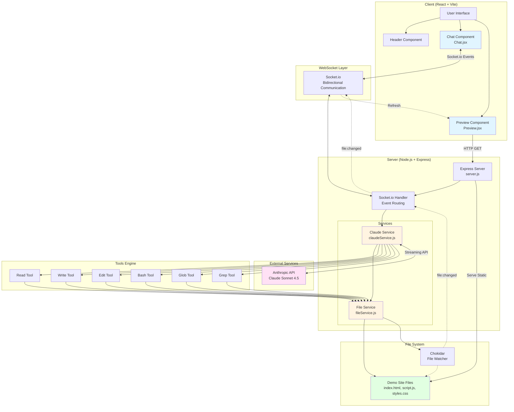
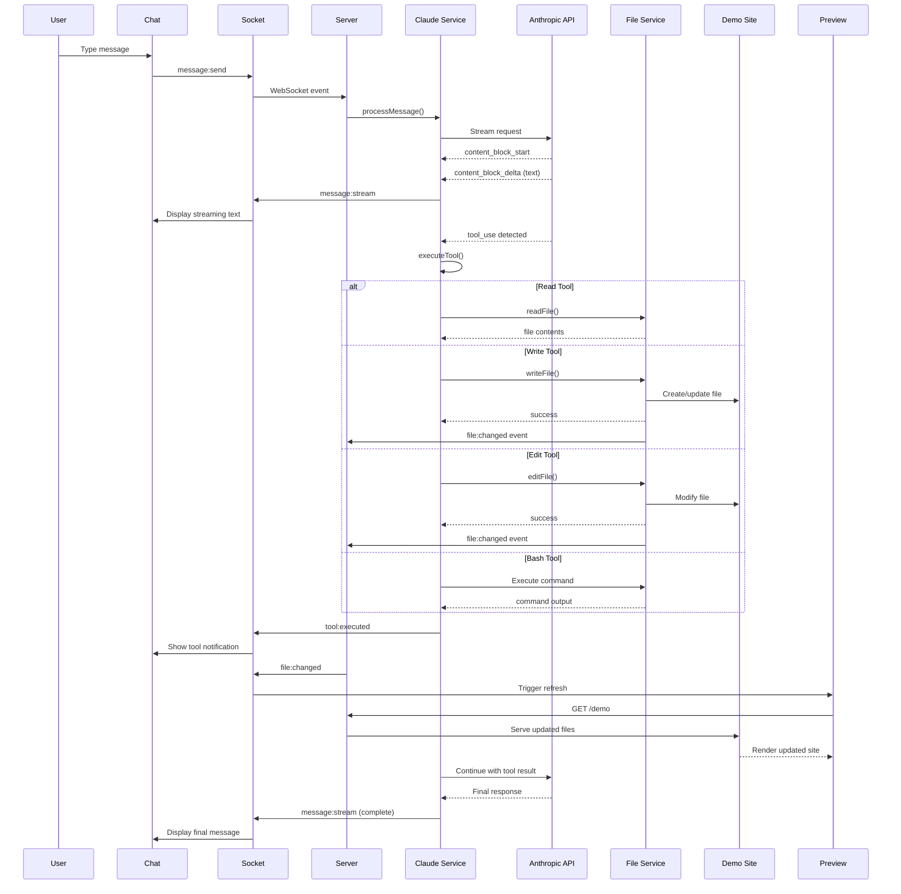
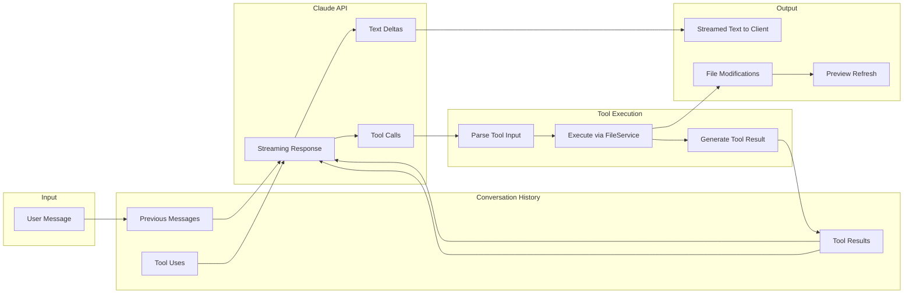

# Demo Code Agent - Architecture Diagram

## System Overview

The demo code agent is a real-time AI-powered code modification system where Claude can read, write, and execute commands on a live demo website with instant preview feedback.

## Architecture Diagram



## Communication Flow



## Data Flow



## Component Responsibilities

### Client Layer

| Component | File | Responsibilities |
|-----------|------|-----------------|
| **App** | `client/src/App.jsx` | Main layout, header + chat + preview panels |
| **Chat** | `client/src/components/Chat/Chat.jsx` | Socket.io connection, message display, streaming |
| **Preview** | `client/src/components/Preview/Preview.jsx` | Iframe displaying demo site, auto-refresh |
| **MessageList** | `client/src/components/Chat/MessageList.jsx` | Render chat messages with markdown |
| **MessageInput** | `client/src/components/Chat/MessageInput.jsx` | User input form |

### Server Layer

| Component | File | Responsibilities |
|-----------|------|-----------------|
| **Express Server** | `server/src/server.js` | HTTP server, static file serving, Socket.io setup |
| **Socket Handler** | `server/src/server.js` | WebSocket event routing, file watching |
| **Claude Service** | `server/src/services/claudeService.js` | Claude API integration, tool execution, streaming |
| **File Service** | `server/src/services/fileService.js` | File operations, change watching, glob/grep |

### Tools

| Tool | Purpose | Input | Output |
|------|---------|-------|--------|
| **Read** | Read file contents | `file_path` | File content string |
| **Write** | Create/overwrite file | `file_path`, `content` | Success message |
| **Edit** | Replace string in file | `file_path`, `old_string`, `new_string` | Success message |
| **Bash** | Execute shell command | `command` | Command output |
| **Glob** | Find files by pattern | `pattern` | Array of file paths |
| **Grep** | Search text in files | `pattern`, `search_path` | Matching lines |

## Socket.io Events

### Client → Server

| Event | Payload | Description |
|-------|---------|-------------|
| `message:send` | `{message, sessionId}` | User sends chat message |
| `files:watch` | - | Start watching demo site files |
| `files:unwatch` | - | Stop watching files |

### Server → Client

| Event | Payload | Description |
|-------|---------|-------------|
| `message:thinking` | `{isThinking}` | AI thinking indicator |
| `message:stream` | `{text, isComplete}` | Streaming text from Claude |
| `tool:executed` | `{tool, success}` | Tool execution notification |
| `file:changed` | `{path}` | File changed (triggers refresh) |
| `error` | `{message}` | Error occurred |

## Conversation History Structure

The Claude service maintains multi-turn conversation history:

```javascript
conversationHistory = [
  {
    role: 'user',
    content: 'Change the background color to blue'
  },
  {
    role: 'assistant',
    content: [
      {
        type: 'tool_use',
        id: 'tool_abc123',
        name: 'Read',
        input: { file_path: 'styles.css' }
      }
    ]
  },
  {
    role: 'user',
    content: [
      {
        type: 'tool_result',
        tool_use_id: 'tool_abc123',
        content: 'body { background: red; }'
      }
    ]
  },
  {
    role: 'assistant',
    content: [
      {
        type: 'tool_use',
        id: 'tool_def456',
        name: 'Edit',
        input: {
          file_path: 'styles.css',
          old_string: 'background: red',
          new_string: 'background: blue'
        }
      }
    ]
  },
  {
    role: 'user',
    content: [
      {
        type: 'tool_result',
        tool_use_id: 'tool_def456',
        content: '{"success": true}'
      }
    ]
  },
  {
    role: 'assistant',
    content: 'I\'ve changed the background color to blue!'
  }
]
```

## Technology Stack

### Frontend
- **React 18.2.0** - UI framework
- **Vite 5.0.8** - Build tool and dev server
- **Socket.io Client 4.7.2** - WebSocket client
- **React Markdown 9.0.1** - Markdown rendering
- **React Syntax Highlighter 15.5.0** - Code highlighting

### Backend
- **Node.js** - Runtime
- **Express 4.18.2** - HTTP server
- **Socket.io 4.7.2** - WebSocket server
- **@anthropic-ai/sdk 0.30.1** - Claude API client
- **Chokidar 3.5.3** - File watching
- **Glob 10.3.10** - Pattern matching
- **CORS 2.8.5** - Cross-origin support

### External APIs
- **Anthropic API** - Claude Sonnet 4.5 (claude-sonnet-4-5-20250929)

## File Structure

```
agent-code-site/
├── client/                    # React frontend
│   ├── src/
│   │   ├── main.jsx          # Entry point
│   │   ├── App.jsx           # Main layout
│   │   └── components/
│   │       ├── Chat/         # Chat UI
│   │       ├── Preview/      # Preview iframe
│   │       └── UI/           # Shared UI components
│   ├── package.json
│   └── vite.config.js
│
├── server/                    # Node.js backend
│   ├── src/
│   │   ├── server.js         # Express + Socket.io
│   │   └── services/
│   │       ├── claudeService.js  # Claude integration
│   │       └── fileService.js    # File operations
│   └── package.json
│
└── demo-site/                 # Files modified by Claude
    ├── index.html
    ├── script.js
    ├── styles.css
    └── package.json
```

## Security Considerations

1. **File System Isolation**: All file operations are restricted to the `demo-site/` directory
2. **Bash Command Safety**: Commands execute in `demo-site/` directory only, 30s timeout
3. **CORS Configuration**: Limited to specified CLIENT_URL
4. **Environment Variables**: API keys stored in `.env` files (not committed)
5. **Input Validation**: File paths validated, directory creation controlled

## Future Improvements (from REBUILD_PLAN.md)

1. **Git Branch Support** - Create unique branches per user request
2. **Approval Queue** - Admin dashboard to review/approve changes
3. **Interruptible Chat** - Allow users to stop ongoing operations
4. **User Identification** - Session management and user tracking
5. **Embedded Chat Widget** - Move from split-view to overlay
6. **Staging/Preview** - Test changes before applying
7. **Enhanced Security** - More granular permissions and sandboxing
