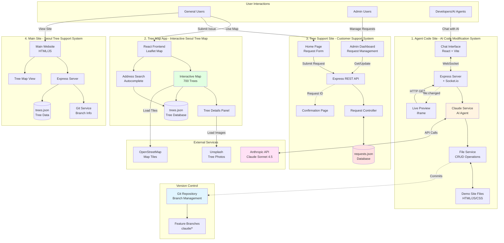
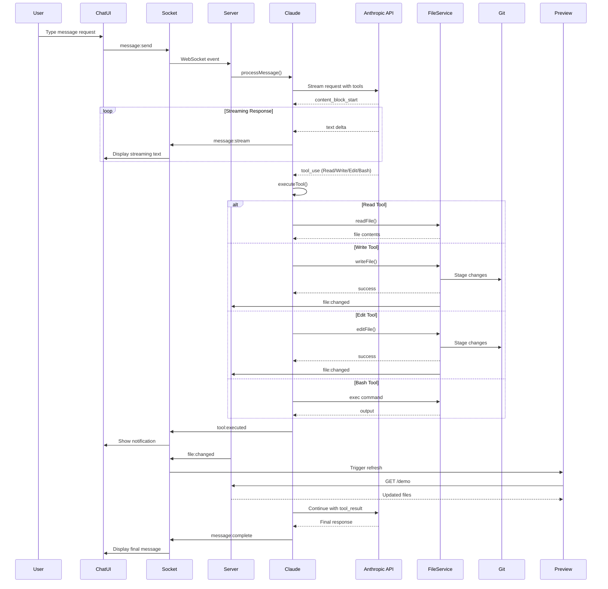
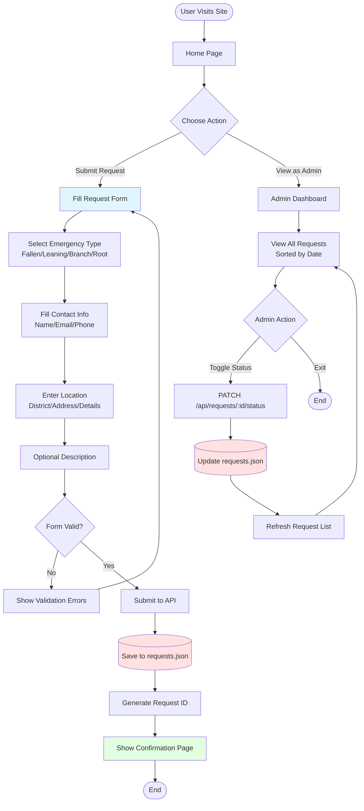
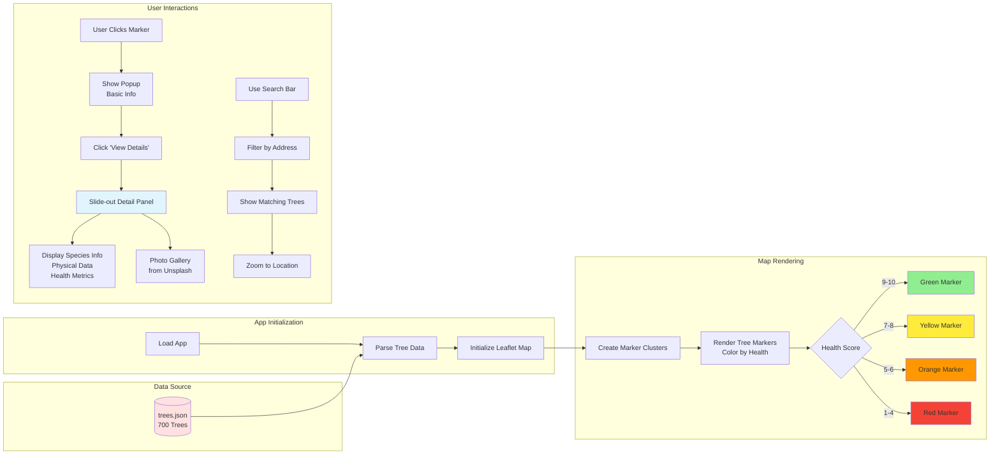
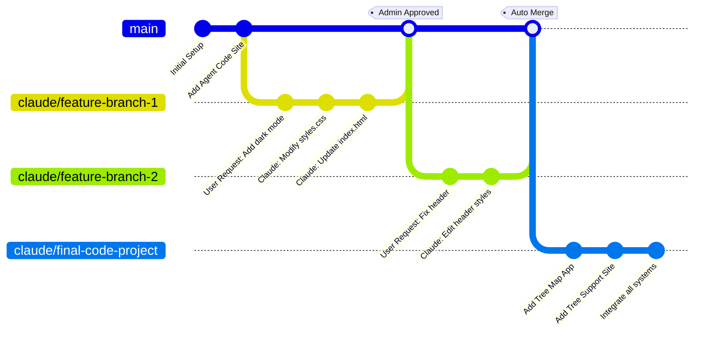
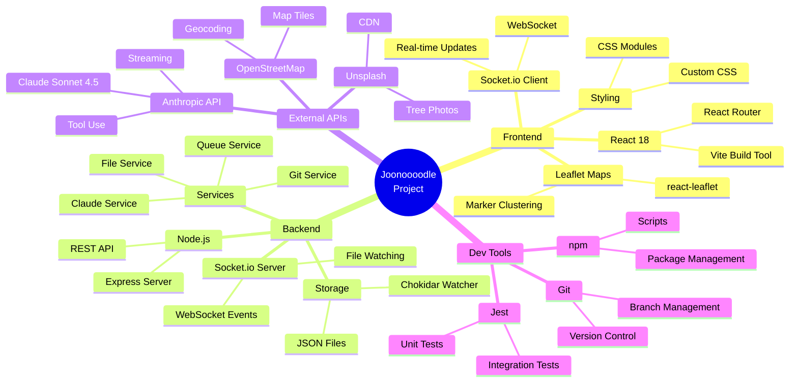
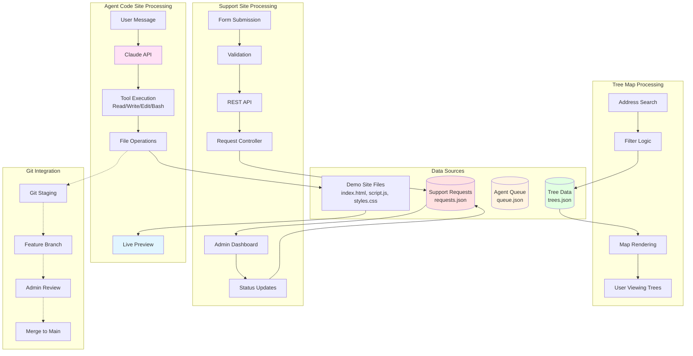
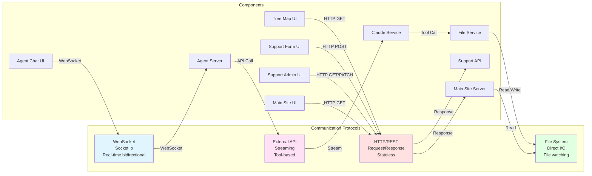

# Joonoooodle Project Workflow

## Overall System Architecture

## Detailed Agent Code Site Workflow

## Tree Support Site User Flow

## Tree Map App Data Flow

## Git Workflow Integration

## Technology Stack Overview

## System Data Flow

## Component Communication Matrix

